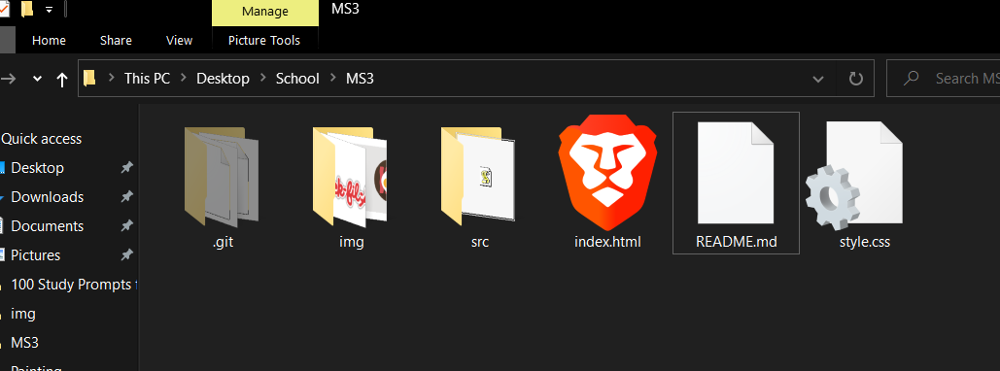
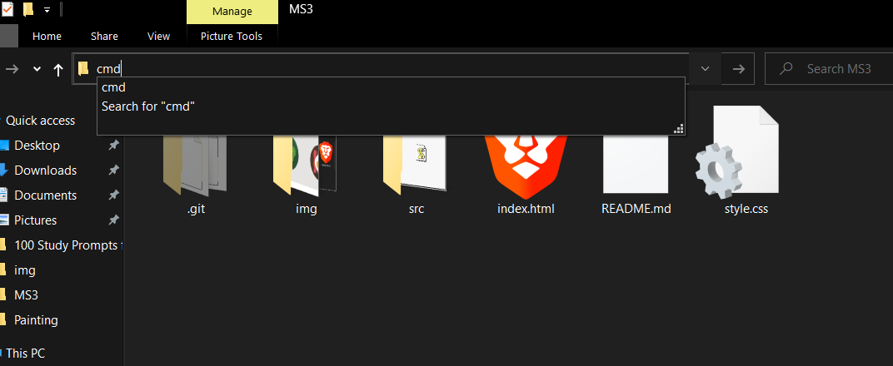
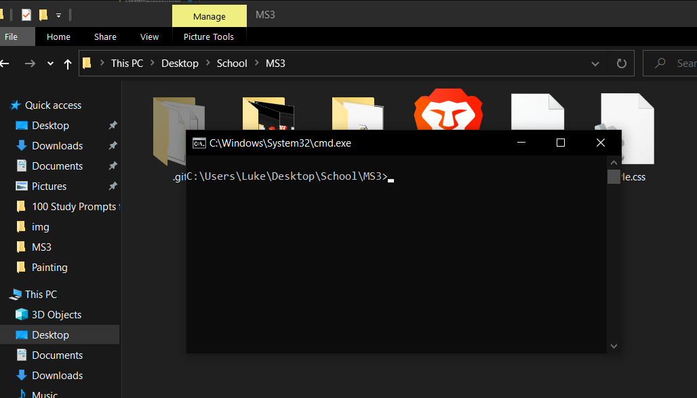

# MS3

## Resources:
- [HTML](https://www.w3schools.com/html/)
- [CSS](https://www.w3schools.com/Css/)
- [Jquery](https://www.w3schools.com/jquery/)
- [Bootstrap](https://www.w3schools.com/bootstrap4/default.asp)

## Setting up your environment:

### Git

First you will need git and setup your repo. I will walk you through setting up git and using it.

1. Download and install [Git](https://git-scm.com/download/win)
2. Open terminal in your desired repo location
   >    This is assuming windows.   
   You can open the terminal in windows by messing with the url in the file explorer:  
    
     
    
3. run the following command:
   ```cmd
    git clone https://github.com/Group-Two-Seven/MS3.git
   ```

You should now have a file named MS3. Inside that folder is your cloned git repo


## Basic Git Commands

Create a new **branch**:
```git
git checkout -b branch-name
```
   >branch-name would be replaced with the name of your **branch**

   
Switch **branch**:
```git
git checkout branch-name
```

Check for **repo** updates (like hitting F5 in a browser, but for your repo):
```git
git fetch
```

### Git Pushing

making changes and pushing to git is more steps than I personally feel it needs to be. We will have 3 steps: adding, committing, and pushing. Each of these mean something different and only pushing will result in changes for everyone who uses the repo.

1. ``` git add . ```  
   This will add your changes to an instance of change. You can think of this like adding your changes to a shopping cart. You havent purchased them, they are tentative.  
   Making another call to **git add .** will result in the cart being updated with your new changelog.  
2. ``` git commit -m "commit message." ```   
    Here is where your changes become lasting, but only locally. If you were to commit new changes 10 times then push a single time, the other repo users could see each of your commits as if you pushed them on each commit. Think back to the shopping cart example, the commit is making a purchase. You could stand in the store and buy 10 cart loads of things, and when you get home (push in this metaphore), you'll have 10 reciptes.  
    Commits are where git's source control power comes from. As an example, if you were to notice an issue after pulling a new commit, you could revert to an older commit to compare the code and find the issues source.
3. ``` git push origin branch-name ```  
    In the shopping metaphor, this is bringing what you brought home. No matter how many individual purchases you made, you only came home *(pushed)* once, and all of your purchases *(commits)* came with you.

That covers the basics of git commands. A word of warning, avoid using -f on any command unless you know what you are doing. Also if you forget the -m next to commit, it will open *vim* in the terminal, hit ":q!" to close it.
  

### Git merge

For now, leave merging to me (Luke). If you want to learn how to do it, its pretty straigt forward and I can show you when I get the chance. Its when there are conflicts that things can get messy fast (especially if -f was used).
